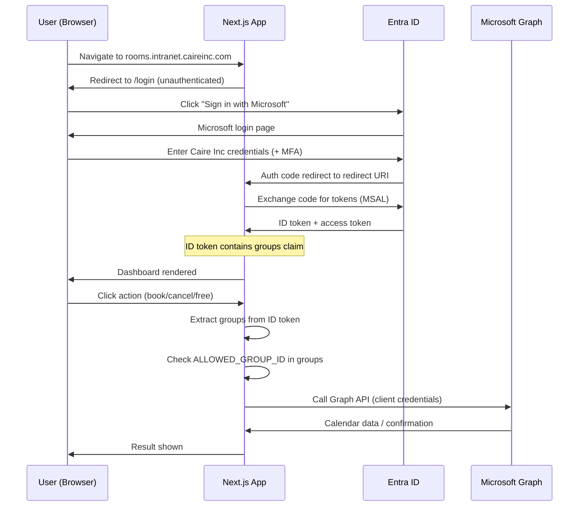
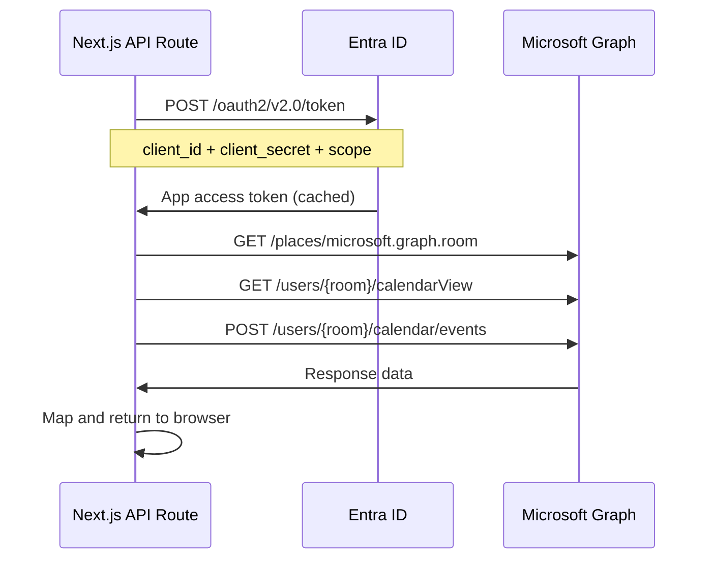

# Caire Room Manager

Conference room management dashboard for Caire Inc. View, book, free, and cancel conference room bookings across all sites directly from a browser — no Outlook required.

Built with Next.js 16, Microsoft Graph API, and Azure Entra ID SSO.

---

## Table of Contents

1. [How It Works](#how-it-works)
2. [Features](#features)
3. [Auth Flow](#auth-flow)
4. [Security Model](#security-model)
5. [Installation](#installation)
6. [Configuration](#configuration)
7. [Deployment](#deployment)
8. [Using the Dashboard](#using-the-dashboard)
9. [Reset & Troubleshooting](#reset--troubleshooting)

---

## How It Works

The dashboard has two distinct layers that work together:

```
┌─────────────────────────────────────────────────────────────────┐
│                        BROWSER (User)                           │
│                                                                 │
│   Next.js App  ──── MSAL.js ────► Azure Entra ID (SSO Login)   │
│       │                                                         │
│       │  Bearer token (ID token with groups claim)              │
│       ▼                                                         │
│   API Routes  ────► Group check ──► Microsoft Graph API         │
│                      (server-side client credentials)           │
└─────────────────────────────────────────────────────────────────┘
```

**User authentication** is handled by MSAL in the browser — users sign in with their Caire Inc Microsoft account via the standard Entra ID login page. No passwords are stored anywhere in the app.

**Graph API calls** (reading calendars, booking rooms, cancelling meetings) are made server-side using a client secret. The user's browser never touches the Graph API directly.

**Access control** is enforced by checking the user's Entra ID group membership on every API call. Only members of the designated EA security group can use the dashboard.

---

## Features

| Feature | Description |
|---------|-------------|
| **Room Sidebar** | Rooms grouped by site (BG2200, BG2205, Other), searchable, filterable by capacity |
| **Timeline View** | Horizontal swimlane view — all rooms on one screen, time on the X axis |
| **Daily View** | Vertical schedule for a single day across all rooms |
| **Weekly View** | 7-day overview across all rooms |
| **Date Range Picker** | Today / This Week / This Month / Next Month presets + custom date range |
| **Quick Book** | Click any empty slot to book it — sets subject, duration, optional note |
| **Event Detail** | Click any booking to see organizer, attendees, status |
| **Free Room** | Remove the room from a meeting without cancelling the whole meeting |
| **Cancel Meeting** | Fully cancel the entire meeting for all attendees |
| **Audit Logging** | Structured JSON logs for every booking, cancellation, and room release |
| **Toast Notifications** | In-app feedback for all actions |

---

## Auth Flow

### User Login (SPA — Delegated)



### Server-to-Graph (Application — Client Credentials)



---

## Security Model

```
┌──────────────────────────────────────────────────────────┐
│                    SECURITY LAYERS                        │
│                                                          │
│  1. Entra ID SSO ──── All users must authenticate        │
│         │             with a valid Caire Inc account      │
│         ▼                                                │
│  2. Group Check ───── User must be a member of           │
│         │             "Caire Room Dashboard - Access"     │
│         │             Entra ID security group             │
│         ▼                                                │
│  3. Token Validation ─ Every API route validates the     │
│         │              Bearer token and re-checks group   │
│         ▼                                                │
│  4. App Permissions ── Graph API calls use client        │
│                        credentials (secret never         │
│                        exposed to browser)               │
└──────────────────────────────────────────────────────────┘
```

| Secret | Where Stored | Exposed to Browser? |
|--------|-------------|---------------------|
| `AZURE_CLIENT_SECRET` | `.env.local` / server env | Never |
| `NEXTAUTH_SECRET` | `.env.local` / server env | Never |
| `AZURE_CLIENT_ID` | `.env.local` + `NEXT_PUBLIC_*` | Yes (safe — public ID) |
| `AZURE_TENANT_ID` | `.env.local` + `NEXT_PUBLIC_*` | Yes (safe — public ID) |
| `ALLOWED_GROUP_ID` | `.env.local` / server env | Never |

**Required Graph API permissions** (Application type, admin consent granted):

| Permission | Purpose |
|-----------|---------|
| `Place.Read.All` | List all room resources in the tenant |
| `Calendars.ReadWrite` | Read, create, and modify events on room calendars |

---

## Installation

### Prerequisites

- Node.js 20+
- Docker + Docker Compose
- Azure Entra ID — Global Admin or Application Admin role
- Exchange Online — room mailboxes with `AutomateProcessing: AutoAccept`

### 1. Clone the repo

```bash
git clone https://github.com/FusedIcer8/caire-room-dashboard.git
cd caire-room-dashboard
npm install
```

### 2. Register the Entra ID app

1. **Entra ID** → **App registrations** → **New registration**
   - Name: `Caire Room Dashboard` (or use existing `CAIRE-TOOLING`)
   - Supported account types: Single tenant
   - Redirect URI: **Single-page application (SPA)** → `https://rooms.intranet.caireinc.com`

2. **API permissions** → Add:
   - `Calendars.ReadWrite` (Application)
   - `Place.Read.All` (Application)
   - Click **Grant admin consent**

3. **Token configuration** → **Add groups claim** → Security groups → ID token → Group ID

4. **Certificates & secrets** → New client secret → copy the value immediately

5. Note the **Application (client) ID** and **Directory (tenant) ID** from Overview

### 3. Create the EA security group

In **Entra ID** → **Groups** → **New group**:
- Type: Security
- Name: `Caire Room Dashboard - Access`
- Membership: Assigned

Note the **Object ID** of the group and add members (EAs and admins who need access).

### 4. Configure environment variables

```bash
cp .env.local.example .env.local
```

Edit `.env.local`:

```env
# Server-side only — never exposed to browser
AZURE_TENANT_ID=your-directory-tenant-id
AZURE_CLIENT_ID=your-application-client-id
AZURE_CLIENT_SECRET=your-client-secret-value
NEXTAUTH_SECRET=generate-with-openssl-rand-base64-32
ALLOWED_GROUP_ID=object-id-of-ea-security-group

# Client-side — safe public identifiers
NEXT_PUBLIC_AZURE_TENANT_ID=your-directory-tenant-id
NEXT_PUBLIC_AZURE_CLIENT_ID=your-application-client-id
```

Generate `NEXTAUTH_SECRET` in PowerShell:
```powershell
[Convert]::ToBase64String((1..32 | ForEach-Object { Get-Random -Maximum 256 }) -as [byte[]])
```

### 5. Set up SSL certificates

```
certs/
├── rooms.crt   ← certificate (PEM format)
└── rooms.key   ← private key (PEM format)
```

Export from your internal CA, or generate a self-signed cert for testing:

```powershell
# Run elevated (Admin)
$cert = New-SelfSignedCertificate `
    -DnsName "rooms.intranet.caireinc.com" `
    -CertStoreLocation "Cert:\LocalMachine\My" `
    -NotAfter (Get-Date).AddYears(2)

# Export to PFX
Export-PfxCertificate -Cert $cert -FilePath "rooms.pfx" -Password (ConvertTo-SecureString "TempPwd" -AsPlainText -Force)

# Convert to PEM using Docker
docker run --rm -v "${PWD}/certs:/certs" alpine sh -c "
  apk add --no-cache openssl &&
  openssl pkcs12 -legacy -in /certs/rooms.pfx -nokeys -clcerts -out /certs/rooms.crt -passin pass:TempPwd &&
  openssl pkcs12 -legacy -in /certs/rooms.pfx -nocerts -nodes  -out /certs/rooms.key -passin pass:TempPwd
"
```

---

## Configuration

### Room Site Mapping

Rooms are grouped into sites based on their email address prefix:

| Email prefix | Site label |
|-------------|-----------|
| `can2200*` | BG2200 |
| `can2205*` | BG2205 |
| anything else | Other |

To change this mapping, edit `src/app/api/rooms/route.ts`:

```typescript
function getSiteLabel(emailAddress: string): string {
  const local = emailAddress.split("@")[0].toLowerCase();
  if (local.startsWith("can2200")) return "BG2200";
  if (local.startsWith("can2205")) return "BG2205";
  return "Other";
}
```

To add more sites, add `if` conditions before the `return "Other"` line and add the new label to the `siteOrder` array directly below it.

---

## Deployment

### Docker (recommended)

```bash
# Build and start
docker compose up -d --build

# Check status
docker compose ps

# View logs
docker compose logs -f dashboard
docker compose logs -f nginx
```

The stack runs two containers:

```
┌─────────────────────────────────────────┐
│              Docker Host                │
│                                         │
│  ┌──────────┐      ┌─────────────────┐  │
│  │  nginx   │─────►│   dashboard     │  │
│  │  :443    │      │   :3000         │  │
│  └──────────┘      └─────────────────┘  │
│       ▲                                 │
└───────┼─────────────────────────────────┘
        │
   Browser (HTTPS)
```

### Update to latest version

```bash
git pull
docker compose down
docker compose up -d --build
```

### DNS

Add an A record in Windows DNS:

```powershell
Add-DnsServerResourceRecordA `
    -ZoneName "intranet.caireinc.com" `
    -Name "rooms" `
    -IPv4Address "<server-ip>"
```

---

## Using the Dashboard

### Viewing rooms

The left sidebar lists all rooms grouped by site. Use the **search box** to filter by name and the **capacity slider** to filter by minimum room size.

### Switching views

| View | Best for |
|------|---------|
| **Timeline** | Seeing all rooms at once, spotting free slots quickly |
| **Daily** | Detailed schedule for a single day |
| **Weekly** | Planning ahead across the week |

### Changing the date range

The date range picker lives in the top bar:

| Preset | Range |
|--------|-------|
| **Today** | Current day (default) |
| **This Week** | Sunday–Saturday of current week |
| **This Month** | Full current calendar month |
| **Next Month** | Full following calendar month |
| **Custom** | Pick any start and end date |

### Booking a room

1. Navigate to the desired date using the date range picker
2. Click any **empty (grey) slot** in the timeline or daily view
3. Fill in the subject, adjust time/duration if needed
4. Optionally add a note or "on behalf of" name
5. Click **Book Room**

### Cancelling or freeing a room

1. Click any **booked (coloured) event** to open the Event Detail panel
2. Choose an action:

| Action | What it does |
|--------|-------------|
| **Free Room Only** | Removes the room from the meeting. The meeting stays on attendees' calendars. Use this when the meeting is moving rooms. |
| **Cancel Entire Meeting** | Cancels the meeting for all attendees. Use this when the meeting is not happening. |

3. Confirm in the dialog

---

## Reset & Troubleshooting

### Restart the app

```bash
docker compose restart dashboard
```

### Full rebuild after code changes

```bash
docker compose down
docker compose up -d --build
```

### Rooms not loading — sidebar empty

Verify room mailboxes exist in Exchange:

```powershell
Connect-ExchangeOnline -UserPrincipalName admin@caireinc.com
Get-Mailbox -RecipientTypeDetails RoomMailbox | Select-Object DisplayName, PrimarySmtpAddress | Format-Table
```

If rooms exist, check that both Graph permissions show **Granted** in the app registration.

### API 500 — "Failed to fetch rooms"

The client secret has likely expired. Check the logs:

```bash
docker compose logs dashboard --tail 50
```

Test the token endpoint directly:

```powershell
$body = @{
    client_id     = "your-client-id"
    client_secret = "your-client-secret"
    scope         = "https://graph.microsoft.com/.default"
    grant_type    = "client_credentials"
}
Invoke-RestMethod -Method Post `
    -Uri "https://login.microsoftonline.com/your-tenant-id/oauth2/v2.0/token" `
    -Body $body
```

If this fails, rotate the secret in the app registration and update `.env.local`.

### 403 after login

The user is not in the `Caire Room Dashboard - Access` security group.

Add them in **Entra ID** → **Groups** → **Caire Room Dashboard - Access** → **Members**.

### SSO redirect loop or blank page after login

Redirect URI mismatch. Verify `https://rooms.intranet.caireinc.com` is listed under:

**App registration** → **Authentication** → **Single-page application** → **Redirect URIs**

It must be type **SPA** — not Web.

### Rotate the client secret

```powershell
# Check expiry
Connect-MgGraph -Scopes "Application.Read.All"
$app = Get-MgApplication -Filter "displayName eq 'CAIRE-TOOLING'"
$app.PasswordCredentials | Select-Object DisplayName, EndDateTime
```

To rotate:
1. Create a new secret in the app registration
2. Update `AZURE_CLIENT_SECRET` in `.env.local` on the server
3. `docker compose restart dashboard`
4. Delete the old secret after confirming the new one works

### View audit logs

```bash
# All logs
docker compose logs dashboard -f

# Audit events only
docker compose logs dashboard --tail 200 | grep audit
```

---

## Quick Reference

| Item | Value |
|------|-------|
| **URL** | `https://rooms.intranet.caireinc.com` |
| **Stack** | Next.js 16, TypeScript, Tailwind v4, MSAL, Graph API |
| **Deployment** | Docker + nginx (port 443) |
| **Auth** | Entra ID SSO (SPA) + Client Credentials (backend) |
| **Graph permissions** | `Place.Read.All`, `Calendars.ReadWrite` (Application) |
| **Access group** | `Caire Room Dashboard - Access` (Entra ID security group) |
| **Cert location** | `certs/rooms.crt`, `certs/rooms.key` |
| **Env config** | `.env.local` (never commit this file) |
| **Logs** | `docker compose logs dashboard` |
| **Rebuild** | `docker compose down && docker compose up -d --build` |
